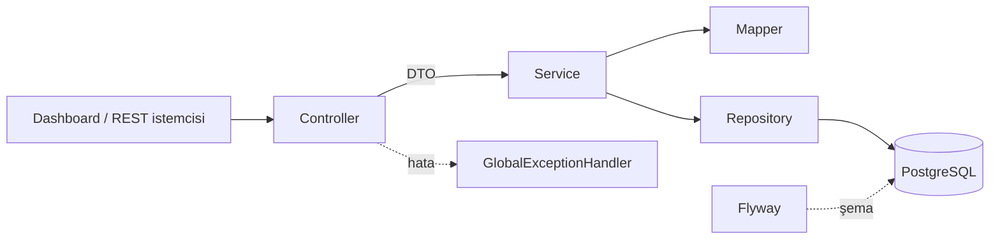
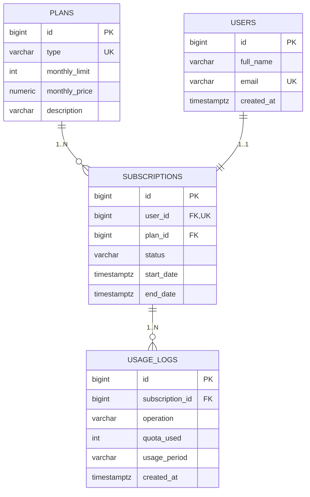
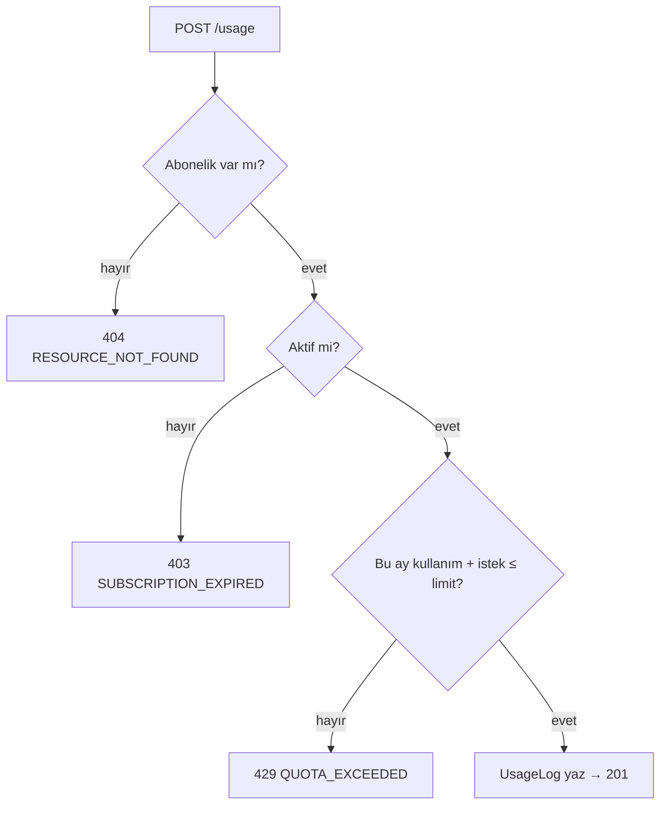

<div align="center">

# 🚦 Quota Platform

**Abonelik paketleri, aylık API kotası takibi ve yönetim paneli içeren SaaS altyapısı**


</div>

---

## 📑 İçindekiler

1. [Genel bakış](#-genel-bakış)
2. [Hızlı başlangıç](#-hızlı-başlangıç)
3. [Demo senaryosu](#-demo-senaryosu)
4. [Mimari](#-mimari)
5. [Veri modeli](#-veri-modeli)
6. [Veritabanı migration (Flyway)](#-veritabanı-migration-flyway)
7. [İş kuralları](#-iş-kuralları)
8. [API](#-api)
9. [Yönetim paneli](#-yönetim-paneli)
10. [Test ve kapsama](#-test-ve-kapsama)
11. [Kod kalitesi](#-kod-kalitesi)
12. [Yapılandırma](#-yapılandırma)
13. [Sorun giderme](#-sorun-giderme)
14. [Proje yapısı](#-proje-yapısı)

---

## 🎯 Genel bakış

Müşterilerin **Free / Pro / Enterprise** paketlerine üye olduğu ve paketlerine tanımlı **aylık API çağrı kotasını** tükettiği bir SaaS altyapısını simüle eder.

| Paket | Aylık limit | Fiyat |
|---|---:|---:|
| 🆓 FREE | 100 | $0 |
| ⭐ PRO | 10.000 | $29.90 |
| 🏢 ENTERPRISE | 1.000.000 | $299.00 |

**Öne çıkanlar**

- ✅ Her kullanım bir `UsageLog` kaydı oluşturur ve aylık kotadan düşer
- ✅ Limit aşımı → `QuotaExceededException`, süresi dolmuş abonelik → `SubscriptionExpiredException`
- ✅ Downgrade kuralı: kullanım hedef paketin limitini aşıyorsa engellenir (`PlanDowngradeNotAllowedException`)
- ✅ Kullanıcı başına tek abonelik (veritabanı seviyesinde garanti)
- ✅ Eşzamanlı isteklerde kota aşımı olmaz (pessimistic lock)
- ✅ Şema Flyway ile yönetilir, Hibernate yalnızca doğrular
- ✅ Yönetim paneli: kota halkası, günlük kullanım grafiği, arama ve plan filtresi

---

## 🚀 Hızlı başlangıç

Üç yoldan biriyle çalıştırın. En kolayı **A**: yalnızca Docker gerekir.

| Yol | Gerekenler | Ne zaman |
|---|---|---|
| **A. Hepsi Docker'da** | Docker | Sadece çalıştırıp görmek isteyenler |
| **B. Maven + Docker'da veritabanı** | JDK 17+, Docker | Geliştirme |
| **C. VS Code** | JDK 17+, Docker, VS Code | Debug / F5 |

### A) Tek komutla (yalnızca Docker)

```bash
docker compose --profile app up --build
```

İlk çalıştırmada imaj derlenir (birkaç dakika sürer). Log'da `Started QuotaPlatformApplication` görünce hazırdır.

### B) Maven ile

```bash
docker compose up -d postgres      # veritabanı (host portu 5544)
./mvnw spring-boot:run             # Maven kuruluysa: mvn spring-boot:run
```

### C) VS Code

1. Klasörü açın, önerilen eklentileri yükleyin (Java Extension Pack, Spring Boot, SonarLint, Draw.io, REST Client).
2. `docker compose up -d postgres`
3. `F5` ile `QuotaPlatformApplication` yapılandırmasını çalıştırın.

### Adresler

| Ne | Adres |
|---|---|
| 🖥️ Yönetim paneli | http://localhost:8085 |
| 📘 Swagger UI | http://localhost:8085/swagger-ui.html |
| 📄 OpenAPI JSON | http://localhost:8085/v3/api-docs |

İlk açılışta 3 plan ve 3 demo kullanıcı otomatik oluşur (`SEED_DEMO=false` ile kapatılır).

Çalıştığını hızlıca doğrulamak için: `curl -s http://localhost:8085/api/v1/plans`

Durdurmak için: `Ctrl+C`, ardından `docker compose --profile app down` (veri kalır) ya da `docker compose --profile app down -v` (veriyi de siler).

---

## 🎬 Demo senaryosu

Panelde (http://localhost:8085) şunları deneyin:

| # | Kullanıcı | Adım | Beklenen |
|:-:|---|---|---|
| 1 | Ayşe (FREE) | "10 istek (burst)" butonuna birkaç kez basın | Kota dolunca `QUOTA_EXCEEDED` |
| 2 | Mehmet (PRO) | FREE kartında "Düşür" | `PLAN_DOWNGRADE_NOT_ALLOWED` (kullanım 2.450) |
| 3 | Mehmet (PRO) | ENTERPRISE kartında "Yükselt" | Başarılı |
| 4 | Herhangi biri | "Aboneliği sonlandır", sonra istek gönderin | `SUBSCRIPTION_EXPIRED` |
| 5 | Aynı kullanıcı | "Yenile" | Abonelik tekrar ACTIVE |
| 6 | Yeni kullanıcı | Aynı e-postayla iki kez kayıt | `DUPLICATE_RESOURCE` |

---

## 🏗️ Mimari



| Paket | Sorumluluk |
|---|---|
| `controller` | REST uçları, doğrulama, Swagger anotasyonları |
| `service` | İş kuralları, transaction sınırları |
| `repository` | Derived query + JPQL (native SQL yok) |
| `entity` | `Plan`, `AppUser`, `Subscription`, `UsageLog` |
| `dto` / `mapper` | `record` DTO'lar ve dönüştürücüler (entity API dışına çıkmaz) |
| `exception` | Özel hatalar + `@RestControllerAdvice` |
| `config` | `Clock`, OpenAPI, seed bileşenleri |

---

## 🗄️ Veri modeli



| İlişki | Uygulama |
|---|---|
| Plan 1–N Subscription | `subscriptions.plan_id`, cascade yok |
| User 1–1 Subscription | `subscriptions.user_id` **UNIQUE**: kullanıcı başına tek abonelik |
| Subscription 1–N UsageLog | `cascade = ALL`, `orphanRemoval = true` |

Tüm ilişkiler `LAZY`, `open-in-view` kapalı, liste ekranında N+1 `join fetch` ile önlenir. Şema diyagramı: [`database-model.drawio`](database-model.drawio) (VS Code'da Draw.io eklentisiyle ya da app.diagrams.net ile açılır).

---

## 🛫 Veritabanı migration (Flyway)

Şema `src/main/resources/db/migration` altındaki SQL dosyalarıyla yönetilir. Hibernate `ddl-auto: validate` ile yalnızca entity ↔ tablo uyumunu kontrol eder, şemayı **değiştirmez**.

| Dosya | İçerik |
|---|---|
| `V1__init_schema.sql` | 4 tablo, unique/foreign key/check kısıtları, `idx_usage_sub_period` indeksi |

**Kurallar**

1. Uygulanmış bir migration dosyası **asla düzenlenmez**. Her değişiklik yeni dosyadır: `V2__aciklama.sql`.
2. Dosya adı biçimi: `V<sürüm>__<açıklama>.sql` (iki alt çizgi).
3. Entity değiştirince önce migration yazılır; uyumsuzluk açılışta `validate` ile yakalanır.

```bash
docker compose exec postgres psql -U quota -d quota_platform \
  -c "select version, description, success from flyway_schema_history;"
```

---

## 📐 İş kuralları

| Kural | Davranış | HTTP |
|---|---|:---:|
| Aylık kota | Bu ayki toplam (`yyyy-MM`, UTC) + istek > limit | **429** `QUOTA_EXCEEDED` |
| Süresi dolmuş abonelik | Durum `EXPIRED` veya bitiş tarihi geçmiş | **403** `SUBSCRIPTION_EXPIRED` |
| Downgrade | Hedef limit < mevcut limit **ve** bu ayki kullanım > hedef limit | **409** `PLAN_DOWNGRADE_NOT_ALLOWED` |
| Aynı pakete geçiş | Mevcut paketle aynı | **400** `INVALID_OPERATION` |
| Yenileme | Yalnızca süresi dolmuş abonelik yenilenir | **400** `INVALID_OPERATION` |
| Tekil e-posta | Aynı e-posta ile ikinci kayıt | **409** `DUPLICATE_RESOURCE` |



> Kota tüketimi abonelik satırında `PESSIMISTIC_WRITE` kilidi alır; paralel isteklerle limit aşılamaz.

---

## 🔌 API

Taban yol: `/api/v1`. Tüm uçlar ve DTO alanları Swagger UI'da açıklamalıdır.

| Metot | Yol | Açıklama |
|:---:|---|---|
| `GET` | `/plans` | Paket kataloğu |
| `POST` | `/users` | Kullanıcı + ilk abonelik (plan verilmezse FREE) |
| `GET` | `/users`, `/users/{id}` | Kullanıcı listesi / detay |
| `GET` | `/users/{id}/subscription` | Abonelik, bu ayki kullanım, kalan kota |
| `PUT` | `/users/{id}/subscription/plan` | Upgrade / downgrade |
| `POST` | `/users/{id}/subscription/renew` | Süresi dolmuş aboneliği yenile |
| `POST` | `/users/{id}/subscription/expire` | (demo) Aboneliği sonlandır |
| `POST` | `/users/{id}/usage` | Kota harca `{operation, units}` |
| `GET` | `/users/{id}/usage/logs?page&size` | Sayfalı kullanım geçmişi (yeniden eskiye) |
| `GET` | `/users/{id}/usage/daily` | Bu ayın günlük kullanımı (UTC, grafik verisi) |

**Örnek**

```bash
curl -X POST http://localhost:8085/api/v1/users/1/usage \
  -H 'Content-Type: application/json' \
  -d '{"operation":"/v1/summarize","units":5}'
```

**Standart hata gövdesi**

```json
{
  "timestamp": "2026-10-04T19:30:12Z",
  "status": 429,
  "error": "Too Many Requests",
  "code": "QUOTA_EXCEEDED",
  "message": "Monthly quota exceeded: used 100, requested 1, limit 100",
  "path": "/api/v1/users/1/usage",
  "validationErrors": null
}
```

Doğrulama hatalarında `validationErrors` alan bazlı mesajlar içerir. Hazır istekler için [`requests.http`](requests.http) dosyasını VS Code REST Client ile çalıştırın (portu 8085'e göre `@base` değişkenini güncelleyin).

---

## 🖥️ Yönetim paneli

Ek bağımlılık ve derleme adımı gerektirmez, uygulamayla birlikte gelir.

| Bölüm | Ne yapar |
|---|---|
| Kullanıcı listesi | Plan/durum rozetleri, ad ve e-posta ile arama, plana göre filtre, yeni kullanıcı |
| Kota halkası | Kullanım yüzdesi (%70 sarı, %90 kırmızı), kalan kota |
| API simülatörü | Tek istek ve 10'luk burst; hatalar `code` ile toast olarak gösterilir |
| Paket kartları | Tek tıkla upgrade / downgrade |
| Abonelik kontrolü | Sonlandır (demo) ve yenile |
| Günlük kullanım grafiği | Bu ayın günlük harcaması (SVG çubuk grafik) |
| Kullanım geçmişi | Sayfalı tablo |

Karanlık/aydınlık tema desteklenir.

---

## 🧪 Test ve kapsama

```bash
./mvnw verify                           # testler + JaCoCo raporu + %70 kapsama kapısı
open target/site/jacoco/index.html      # kapsama raporu (macOS)
```

> ⚠️ Integration testler **Testcontainers** kullanır: **Docker çalışıyor olmalı**. Docker yoksa yalnızca derlemek için `./mvnw package -DskipTests`.

| Tür | Kapsam |
|---|---|
| Unit | Servisler, mapper, guard, handler, seeder (JUnit 5 + Mockito) |
| Integration | `@SpringBootTest` + MockMvc + gerçek PostgreSQL 16 (Testcontainers), Flyway migration'ı dahil, 16 senaryo |
| Kapı | JaCoCo satır kapsamı < %70 ise build başarısız olur (mevcut: %98) |

---

## 🔍 Kod kalitesi

**VS Code:** SonarLint eklentisi (`.vscode/extensions.json` ile önerilir).

**SonarQube taraması** (isteğe bağlı, yerel sunucu)

```bash
docker run -d --name sonarqube-quota -p 9100:9000 sonarqube:community
# http://localhost:9100 → My Account → Security → Global Analysis Token üretin

export SONAR_TOKEN=TOKEN_BURAYA      # kendi token'ınız; repoya asla yazmayın
./mvnw verify org.sonarsource.scanner.maven:sonar-maven-plugin:5.0.0.4389:sonar \
  -Dsonar.host.url=http://localhost:9100
```

Mevcut sonuç: Quality Gate **Passed**, Security / Reliability / Maintainability **A**, 0 sorun.

---

## ⚙️ Yapılandırma

| Değişken | Varsayılan | Açıklama |
|---|---|---|
| `SERVER_PORT` | `8085` | Uygulama portu (Maven ile çalışırken) |
| `DB_URL` | `jdbc:postgresql://localhost:5544/quota_platform` | JDBC adresi |
| `DB_USER` / `DB_PASSWORD` | `quota` / `quota` | Yalnızca yerel geliştirme için varsayılan. Gerçek ortamda mutlaka değiştirin |
| `SEED_DEMO` | `true` | Demo kullanıcıları oluştur |
| `POSTGRES_PORT` / `APP_PORT` | `5544` / `8085` | Docker'ın host portları |

Docker için değerleri değiştirmek isterseniz:

```bash
cp .env.example .env     # .env repoya girmez (.gitignore)
```

`mvn spring-boot:run` ile çalışırken port değiştirmek için: `SERVER_PORT=8090 DB_URL=jdbc:postgresql://localhost:5555/quota_platform ./mvnw spring-boot:run`

---

## 📝 Loglama

SLF4J / Logback kullanılır. Kişisel veri (e-posta vb.) loglanmaz, yalnızca ID, plan ve miktar yazılır.

| Seviye | Ne loglanır |
|---|---|
| `INFO` | Kullanıcı kaydı, paket değişikliği, abonelik yenileme/sonlandırma |
| `WARN` | İş kuralı reddi (`QUOTA_EXCEEDED`, `SUBSCRIPTION_EXPIRED`, `PLAN_DOWNGRADE_NOT_ALLOWED`, …), `GlobalExceptionHandler` tarafından merkezi olarak |
| `ERROR` | Beklenmeyen hatalar (yığın izi ile) |
| `DEBUG` | Her kota harcaması |

Seviyeyi değiştirmek için: `LOGGING_LEVEL_COM_SAASPLATFORM_QUOTA=DEBUG ./mvnw spring-boot:run`

---

## 🛠️ Sorun giderme

| Belirti | Neden | Çözüm |
|---|---|---|
| `port is already allocated` | Host portu başka container/uygulamada | `.env` içinde `POSTGRES_PORT` / `APP_PORT` değiştirin |
| `Port 8085 was already in use` | Başka bir süreç 8085'i kullanıyor | `lsof -i :8085` ile bulun ya da `SERVER_PORT=8090` verin |
| `password authentication failed` | Yanlış PostgreSQL'e bağlanılıyor | `DB_URL` portunun bu projenin container'ına ait olduğunu doğrulayın |
| `Found non-empty schema(s) without schema history table` | Veritabanı Flyway'siz kurulmuş | `docker compose down -v`, sonra tekrar `up` |
| `Schema-validation: missing table/column` | Entity ile migration uyumsuz | Yeni bir `V<n>__...sql` migration yazın |
| `Could not find a valid Docker environment` | Docker kapalı | Docker Desktop'ı başlatın |
| `./mvnw: Permission denied` | Çalıştırma izni yok | `chmod +x mvnw` |
| Panel eski görünüyor | Tarayıcı önbelleği | `Cmd/Ctrl + Shift + R` |

---

## 📂 Proje yapısı

```text
quota-platform/
├── pom.xml
├── mvnw, mvnw.cmd, .mvn/        # Maven wrapper (Maven kurulumu gerekmez)
├── Dockerfile
├── docker-compose.yml
├── .env.example
├── database-model.drawio
├── requests.http
├── README.md
├── .vscode/                     # önerilen eklentiler, F5 yapılandırması
└── src/
    ├── main/
    │   ├── java/com/saasplatform/quota/
    │   │   ├── config/  controller/  dto/  entity/
    │   │   ├── exception/  mapper/  repository/  service/  util/
    │   │   └── QuotaPlatformApplication.java
    │   └── resources/
    │       ├── application.yml
    │       ├── db/migration/V1__init_schema.sql
    │       └── static/index.html          # yönetim paneli
    └── test/
        ├── java/…                          # unit + integration (Testcontainers)
        └── resources/application-test.yml
```
